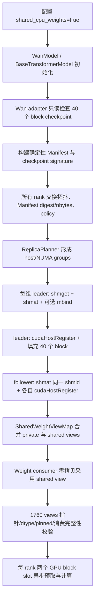

# LightX2V 共享 CPU 权重 offload 使用与代码接入报告

- 日期：2026-09-14
- 项目：`/data/liuhongda/lightx2v_offload_opt`
- 目标：Wan `fp8-vllm`、block offload、sequence parallel，并在同一主机的多个 rank 间共享 DiT block 的 pinned CPU 物理页。

## 1. 结论先行

当前实现共享的是 **Wan DiT block 权重的 CPU 物理页**，不是共享整个模型：

- 同一共享域只保留一份 DiT block CPU 权重。
- 每个 rank 用 `shmat` 获得独立虚拟地址，并对自己的地址执行 `cudaHostRegister`。
- 每个 rank 仍有两个独立的 GPU block slot，用于当前 block 计算和下一 block 异步预取。
- `non_block.safetensors` 仍是 rank-private CPU 权重。
- T5、CLIP、VAE 不经过共享 arena；当前配置下，它们在每个 rank 对应 GPU 上各有一份完整权重。
- sequence parallel 切分的是 sequence/activation 计算，不会自动切分模型权重。

本机 8 卡跨两个 NUMA 节点时：

- `scope=host`：8 rank 共用 1 份 15.061 GiB block arena，CPU 内存最低，但可能发生跨 NUMA 访问和带宽竞争。
- `scope=numa`：NUMA 0 与 NUMA 1 各 1 份，共 30.122 GiB；每组 GPU 从本地 NUMA 读取。
- `scope=auto`：拓扑可识别时自动等价于 `numa`，建议作为默认选择。

## 2. 直接运行

当前本地/实验入口（实现尚未提交，且本轮 E2E 每项只跑 1 次，不将其标记为已经生产并发验证的入口）：

- 启动脚本：[run_wan_i2v_block_shared_offload_sp8.sh](/data/liuhongda/lightx2v_offload_opt/scripts/wan/run_wan_i2v_block_shared_offload_sp8.sh:1)
- 配置文件：[wan_i2v_block_shared_sp8.json](/data/liuhongda/lightx2v_offload_opt/configs/offload/block/wan_i2v_block_shared_sp8.json:1)

执行：

```bash
cd /data/liuhongda/lightx2v_offload_opt
bash scripts/wan/run_wan_i2v_block_shared_offload_sp8.sh
```

默认视频输出到 `/data/liuhongda/lightx2v_offload_opt/save_results/output_lightx2v_wan_i2v_block_shared_offload_sp8.mp4`。重复运行会覆盖该文件；需保留多次结果时，应复制启动脚本/配置并修改 `--save_result_path`。

当前配置文件中的 scope 是 `host`。若要让程序根据所选 GPU 的 PCI/NUMA 拓扑自动分组，建议改为：

```json
"shared_cpu_weight_scope": "auto"
```

关键配置为：

```json
{
  "cpu_offload": true,
  "offload_granularity": "block",
  "dit_quantized": true,
  "dit_quant_scheme": "fp8-vllm",
  "shared_cpu_weights": true,
  "shared_cpu_weight_backend": "sysv",
  "shared_cpu_weight_scope": "auto",
  "shared_cpu_weight_strict_numa": true,
  "shared_cpu_weight_register_chunk_mb": 128,
  "lazy_load": false,
  "unload_modules": false,
  "t5_cpu_offload": false,
  "clip_cpu_offload": false,
  "vae_cpu_offload": false,
  "parallel": {
    "seq_p_size": 8,
    "seq_p_attn_type": "ulysses",
    "cfg_p_size": 1,
    "vae_parallel": true
  }
}
```

启动环境还需保持 `DTYPE=FP16` 与 `SENSITIVE_LAYER_DTYPE=FP16`。当前 Wan shared adapter 会拒绝两者不一致的设置，避免不同 rank/消费路径对同一 arena 做不一致解释。

当 `tensor_p_size=1` 且 `cfg_p_size=1` 时，为避免选卡歧义，建议以下三处保持一致：

1. `CUDA_VISIBLE_DEVICES` 中可见 GPU 的数量。
2. `torchrun --nproc-per-node`。
3. 配置中的 `parallel.seq_p_size`。

框架的真正约束是 `tensor_p_size × cfg_p_size × seq_p_size = world_size`；`CUDA_VISIBLE_DEVICES` 可以暴露更多 GPU，但当前单节点脚本令可见卡数与 `nproc-per-node` 相等，映射最清晰。

例如选物理 GPU `0,1,4,5` 做 SP4 时，local rank 0–3 分别使用物理 GPU 0、1、4、5。NUMA 分组依据 PCI BDF 自动发现，不是依据 local rank 编号猜测。

## 3. scope 如何选择

| scope | replica 规则 | 适用场景 | 代价 |
|---|---|---|---|
| `auto` | NUMA 发现成功时按活跃 GPU NUMA 分组；sysfs 明确返回 `-1` 时该 host cohort 回退到 `host` | 推荐默认值，单/多 NUMA 均可泛化 | 回退时不能保证本地性；sysfs 不可读/格式错误会直接报错 |
| `numa` | 每个活跃 GPU NUMA 节点一份 arena | 已知拓扑且希望控制内存带宽 | NUMA 无法识别时直接报错 |
| `host` | 同主机、同 IPC namespace、同权重签名的 rank 共用一份 | CPU 容量最紧张，或需要验证最小副本数 | 可能跨 socket 读远端页，并争用同一内存带宽 |

程序不会按“机器总 NUMA 数量”盲目创建副本，而只按本次参与运行的 GPU 覆盖到的 NUMA 域创建：

- 单 NUMA 机器：`auto`/`numa` 都是一份。
- 四 NUMA 机器但只选中两个 NUMA 域：只创建两份。
- 单 GPU：三种 scope 都只有一份。
- 多主机：coordinator 的分组模型会为每台主机独立创建 SysV arena，SysV 不能跨主机共享；当前脚本与本轮验证均为单节点，完整多节点启动链尚未验证。

上述单/4 NUMA 和多 host 结论来自 planner 逻辑与单元测试；本轮物理验证机器只有 2 个 NUMA 节点。SP1 只表示在这台双 NUMA 机器上选中了一个活跃节点，不等同于已在真正单 NUMA 物理机上验证。

`shared_cpu_weight_strict_numa=false` 仅表示 `mbind` 失败时告警并继续，不放宽 sysfs 读取/格式错误，也不代表显式 `numa` 可以接受未知拓扑。

## 4. 总体调用链



主要入口：

- BaseModel 初始化包装：[base_model.py:237](/data/liuhongda/lightx2v_offload_opt/lightx2v/models/networks/base_model.py:237)
- Wan 模型 hook：[wan/model.py:62](/data/liuhongda/lightx2v_offload_opt/lightx2v/models/networks/wan/model.py:62)
- Wan checkpoint adapter：[shared_block_weights.py:105](/data/liuhongda/lightx2v_offload_opt/lightx2v/models/networks/wan/shared_block_weights.py:105)
- 模型无关 coordinator：[shared_weight_coordinator.py:114](/data/liuhongda/lightx2v_offload_opt/lightx2v/common/offload/shared_weight_coordinator.py:114)
- 底层 arena：[shared_pinned_arena.py:1090](/data/liuhongda/lightx2v_offload_opt/lightx2v/common/offload/shared_pinned_arena.py:1090)

## 5. 核心代码解析

### 5.1 Manifest：先定义“这些字节是什么”

`TensorSpec` 在 [shared_pinned_arena.py:96](/data/liuhongda/lightx2v_offload_opt/lightx2v/common/offload/shared_pinned_arena.py:96)，记录：

- 权重名、arena 字节偏移与存储字节数；
- dtype 与物理 `storage_shape`；
- 对外逻辑 shape、stride、storage offset。

这使转置 FP8 矩阵也能保留为同一 storage 上的 strided view，而不必复制。逻辑地址为：

```text
tensor.data_ptr = arena.address
                + spec.offset
                + spec.storage_offset * spec.itemsize
```

`SharedWeightManifest` 在 [shared_pinned_arena.py:199](/data/liuhongda/lightx2v_offload_opt/lightx2v/common/offload/shared_pinned_arena.py:199)：

- 权重名排序，保证所有 rank 布局确定；
- 每个 tensor 按 `lcm(alignment, itemsize)` 对齐；
- Wan adapter 使用 4096 字节对齐；
- 规范化 JSON 后计算 SHA-256 digest。

Coordinator 会比较所有 rank 的 manifest digest 和总字节数。如果 checkpoint schema、dtype 或布局不一致，会在创建共享段前统一失败，不会错误地把不同 tensor 解释成同一片内存。

### 5.2 拓扑发现与 replica 分组

拓扑记录与自动发现位于：

- [TopologyRecord](/data/liuhongda/lightx2v_offload_opt/lightx2v/common/offload/shared_pinned_arena.py:399)
- [discover](/data/liuhongda/lightx2v_offload_opt/lightx2v/common/offload/shared_pinned_arena.py:424)
- [ReplicaPlanner](/data/liuhongda/lightx2v_offload_opt/lightx2v/common/offload/shared_pinned_arena.py:495)

每个 rank 收集：

```text
host_id = hostname + boot_id
ipc_namespace = /proc/self/ns/ipc
PCI BDF = CUDA device -> cudaDeviceGetPCIBusId
NUMA node = /sys/bus/pci/devices/<BDF>/numa_node
weight_signature = checkpoint 内容与加载语义的哈希
```

实际 group key 为：

```text
(host_id, ipc_namespace, weight_signature, numa_node-or-None)
```

加入 IPC namespace 和 boot ID 可避免容器/重启场景错误共享；加入权重签名可防止不同 checkpoint 的 rank 共用同一段。

### 5.3 SysV 共享内存

Leader 的创建路径在 [shared_pinned_arena.py:663](/data/liuhongda/lightx2v_offload_opt/lightx2v/common/offload/shared_pinned_arena.py:663)：

1. `shmget(IPC_PRIVATE, size, IPC_CREAT | IPC_EXCL | 0600)`。
2. leader 执行 `shmat`。
3. 立即 `IPC_RMID`，标记为最后一个进程 detach 后自动销毁。
4. 在首次写页前按需执行 `mbind(MPOL_BIND)`。
5. 注册 CUDA host memory，然后由 leader 填充权重。

Follower 路径在 [shared_pinned_arena.py:699](/data/liuhongda/lightx2v_offload_opt/lightx2v/common/offload/shared_pinned_arena.py:699)：

1. 用 leader 广播的 shmid 做 `IPC_STAT` 和大小校验。
2. `shmat` 同一个物理 segment。
3. 对 follower 自己的虚拟地址执行 `cudaHostRegister`。

各 rank 的虚拟地址通常不同，但底层物理页相同。

### 5.4 为什么每个 rank 都要 `cudaHostRegister`

`cudaHostRegister` 注册的是调用进程中的虚拟地址范围。一个进程完成注册，不能替代另一个进程的地址注册。因此：

- `shmat` 解决多个进程映射同一组物理页；
- `cudaHostRegister` 让当前进程可以从自己的映射发起异步 H2D DMA；
- 每 rank 都有注册元数据和虚拟映射，但不会因此复制 N 份物理权重页。

CUDA ctypes 封装和注册生命周期分别位于：

- [CudaRuntime](/data/liuhongda/lightx2v_offload_opt/lightx2v/common/offload/shared_pinned_arena.py:831)
- [CudaHostRegistration](/data/liuhongda/lightx2v_offload_opt/lightx2v/common/offload/shared_pinned_arena.py:905)

注册区间由 [build_tensor_aware_registration_regions](/data/liuhongda/lightx2v_offload_opt/lightx2v/common/offload/shared_pinned_arena.py:312) 生成。配置中的 128 MiB 是目标 chunk：

- 内部边界页对齐；
- 不允许一个 tensor 横跨两个独立 registration；
- 单个 tensor 超过 128 MiB 时，该 registration 可以更大。

本次 Wan 权重每 rank 注册 120 个区间，覆盖完整 16,171,827,200 字节 arena。

### 5.5 从外部地址构造 PyTorch tensor view

[tensor_views](/data/liuhongda/lightx2v_offload_opt/lightx2v/common/offload/shared_pinned_arena.py:1266) 的转换链为：

```text
SysV 地址
  -> ctypes byte buffer
  -> torch.frombuffer(uint8)
  -> narrow(offset, nbytes)
  -> view(dtype)
  -> view(storage_shape)
  -> 必要时 torch.as_strided
```

`torch.frombuffer` 持有 backing object，backing object 又持有 arena lifetime，可防止普通垃圾回收过早释放映射。但显式调用 `close_shared_cpu_weights()` 仍会立即 unregister 并 detach；close 之后绝不能再访问已导出的 CPU block tensor view。

### 5.6 分布式协调与防死锁

[materialize_shared_weight_arena](/data/liuhongda/lightx2v_offload_opt/lightx2v/common/offload/shared_weight_coordinator.py:114) 分三阶段收敛错误：

1. 所有 rank 交换 topology、manifest digest、arena 大小和 policy。
2. 每组 leader 创建、注册并填充；所有 leader 都成功后才进入下一阶段。
3. follower attach/register；所有 rank 都成功后才返回权重 view。

对当前实现覆盖的配置、checkpoint、leader populate 和 follower attach/register 异常，三阶段 collective 会让所有 rank 一致失败，不会让健康 rank 继续进入下一阶段。进程被 `SIGKILL`、CUDA context 崩溃、NCCL/网络故障或某 rank 永远未到达 collective 时，仍应依赖 torchrun/NCCL timeout。模型在进入 coordinator 之前的本地 checkpoint/header 读取错误也通过 [coordinate_rank_local_error](/data/liuhongda/lightx2v_offload_opt/lightx2v/common/offload/shared_weight_coordinator.py:80) 统一传播。

本次 `host` SP8 完整推理已验证不会死锁；其性能权衡见实验报告。

### 5.7 Wan `fp8-vllm` adapter

[WanFp8VllmSharedBlockAdapter](/data/liuhongda/lightx2v_offload_opt/lightx2v/models/networks/wan/shared_block_weights.py:105) 负责模型专属语义：

- 只扫描 `block_0.safetensors` 到 `block_39.safetensors`；
- 检查文件索引完整、tensor 属于正确 block，以及 40 个 block 的 canonical tensor key 集合一致；每个 entry 的 dtype/shape 会分别解析到 manifest。
- 复现原 `fp8-vllm` 加载后的目标 dtype；
- 对 checkpoint 内容、文件大小、推理 dtype、层数计算稳定 signature；
- 每个共享 group 只让 leader 读取和填充 40 个 block payload。

权重内容哈希会直接采用格式有效且时间戳与 checkpoint mtime 匹配的 Hugging Face metadata SHA-256；metadata 缺失或陈旧时回退到全文件流式 SHA-256，格式非法的 metadata 则直接报错，见 [shared_block_weights.py:62](/data/liuhongda/lightx2v_offload_opt/lightx2v/models/networks/wan/shared_block_weights.py:62)。

FP8 权重保持 FP8；`weight_scale` 按原加载语义保存为 FP32；普通浮点权重转成 inference dtype。相关逻辑见 [shared_block_weights.py:91](/data/liuhongda/lightx2v_offload_opt/lightx2v/models/networks/wan/shared_block_weights.py:91)。

### 5.8 private/shared 权重统一消费

[SharedWeightViewMap](/data/liuhongda/lightx2v_offload_opt/lightx2v/common/offload/shared_weight_map.py:20) 把两类权重暴露成一个 Mapping：

- private `non_block`：消费后 `pop`，释放临时字典引用；
- shared block view：不从 arena 删除，只记录已消费 key。

通用入口 [consume_weight](/data/liuhongda/lightx2v_offload_opt/lightx2v/common/offload/shared_weight_map.py:74) 已接入：

- Linear/MM/Norm/Conv 等：[utils.py:173](/data/liuhongda/lightx2v_offload_opt/lightx2v/common/ops/utils.py:173)
- DefaultTensor：[tensor.py:34](/data/liuhongda/lightx2v_offload_opt/lightx2v/common/ops/tensor/tensor.py:34)
- Embedding：[embedding_weight.py:34](/data/liuhongda/lightx2v_offload_opt/lightx2v/common/ops/embedding/embedding_weight.py:34)

shared tensor 会直接成为模块的 `pin_*` view，不再执行一次新的 `torch.empty(pin_memory=True)` 和 `copy_`。FP8 transpose 使用 `.t()` view，仍指向同一物理 storage。

Wan 完成加载后会验证全部 1760 个 block tensor：

- manifest key 全部被消费；
- `data_ptr` 精确等于 arena 计算地址；
- dtype 一致；
- `tensor.is_pinned()` 为真。

验证代码在 [wan/model.py:91](/data/liuhongda/lightx2v_offload_opt/lightx2v/models/networks/wan/model.py:91)。这能发现“值相同但加载器偷偷复制成 rank-private tensor”的错误。

### 5.9 与原 block offload 双 buffer 的关系

共享 arena 只替换 CPU staging 权重的所有权，不改变 block offload 调度：

1. 每个 rank 在 GPU 上创建两个 block slot，见 [transformer_weights.py:162](/data/liuhongda/lightx2v_offload_opt/lightx2v/models/networks/wan/weights/transformer_weights.py:162)。
2. slot A 计算当前 block。
3. load stream 把下一 block 从共享 pinned CPU view 异步搬到 slot B。
4. load/compute stream 同步后交换 A/B。
5. 40 个 block 循环执行。

核心调用：

- 首块搬运：[manager.py:63](/data/liuhongda/lightx2v_offload_opt/lightx2v/common/offload/manager.py:63)
- 下一块预取：[manager.py:78](/data/liuhongda/lightx2v_offload_opt/lightx2v/common/offload/manager.py:78)
- slot 交换：[manager.py:92](/data/liuhongda/lightx2v_offload_opt/lightx2v/common/offload/manager.py:92)
- Wan 推理循环：[transformer_infer.py:40](/data/liuhongda/lightx2v_offload_opt/lightx2v/models/networks/wan/infer/offload/transformer_infer.py:40)

## 6. 内存分配模型

设：

- `B`：一份完整 DiT block CPU arena；本次 `B = 15.061 GiB`。
- `R`：本机参与的 rank 数。
- `D`：所选 GPU 覆盖的活跃 NUMA 域数。
- `P`：每 rank 的 non-block、Python/runtime 等私有 CPU 内存。

物理内存的简化近似模型为：

```text
普通 SP block offload = R * B + R * P
shared scope=host    = 1 * B + R * P
shared scope=numa    = D * B + R * P
shared scope=auto    = D * B + R * P  （拓扑完整）
                       1 * B + R * P  （该主机拓扑不完整而回退）
```

本机精确的 DiT block payload 结构量：

| SP | scope | arena 数 | DiT block 物理页 | 相对 rank-private block 页节省 |
|---:|---|---:|---:|---:|
| 1 | auto/numa/host | 1 | 15.061 GiB | 0% |
| 4（物理 GPU 0,1,4,5） | auto/numa | 2 | 30.122 GiB | 50% |
| 4（物理 GPU 0,1,4,5） | host | 1 | 15.061 GiB | 75% |
| 8 | auto/numa | 2 | 30.122 GiB | 75% |
| 8 | host | 1 | 15.061 GiB | 87.5% |

注意统计口径：

- 每个 rank 都映射 15.061 GiB，因此 VIRT 相加仍接近 `R * B`。
- RSS 会在多个进程中重复计算同一物理页，不能用 `sum(RSS)` 判断节省量。
- 应优先使用 PSS、每个唯一 shmid 的 segment 大小和 `numa_maps` 驻留页。只有当采样纳入该 segment 的所有 mapper 时，该映射的 sum PSS 才近似物理驻留；全进程树 PSS 仍是非原子采样估计。
- Linux `smaps Locked` 对 `cudaHostRegister` 地址可能仍显示 0；pinned 正确性由 CUDA 注册覆盖、`is_pinned()` 与异步 H2D 校验共同证明。

## 7. 当前 SP8 各组件放置

启动脚本中 `CUDA_VISIBLE_DEVICES=0,1,2,3,4,5,6,7`，每个进程把设备设为自己的 distributed rank。因此当前映射是 rank 0–7 对应物理 GPU 0–7。

| 组件 | CPU 侧 | GPU 侧 |
|---|---|---|
| DiT block | 按 host/NUMA 共享 pinned 物理页 | 每 rank 两个 private block slot |
| DiT `non_block` | 每 rank 私有 | 按模型逻辑使用 |
| T5 | 不在 shared arena | 每 rank 一份完整模型，常驻对应 GPU |
| CLIP | 不在 shared arena | 每 rank 一份完整模型，常驻对应 GPU |
| VAE | 不在 shared arena | 每 rank 一份完整模型；encoder/decoder 复用同一对象 |

`vae_parallel=true` 只对 VAE 输入/输出空间进行切分和 all-gather，不切分 VAE 参数。当前又有：

```json
"lazy_load": false,
"unload_modules": false,
"t5_cpu_offload": false,
"clip_cpu_offload": false,
"vae_cpu_offload": false
```

所以 T5、CLIP、VAE 在 40 步 DiT 期间不会被卸载到 CPU。

代码证据：

- 每 rank 构建 runner：[infer.py:227](/data/liuhongda/lightx2v_offload_opt/lightx2v/infer.py:227)
- 每 rank 加载 transformer/T5/CLIP/VAE：[default_runner.py:282](/data/liuhongda/lightx2v_offload_opt/lightx2v/models/runners/default_runner.py:282)
- T5 GPU device 与 `load_from_rank0=False`：[wan_runner.py:324](/data/liuhongda/lightx2v_offload_opt/lightx2v/models/runners/wan/wan_runner.py:324)
- CLIP GPU device 与独立加载：[wan_runner.py:283](/data/liuhongda/lightx2v_offload_opt/lightx2v/models/runners/wan/wan_runner.py:283)
- VAE GPU device/parallel 参数：[wan_runner.py:386](/data/liuhongda/lightx2v_offload_opt/lightx2v/models/runners/wan/wan_runner.py:386)
- VAE encoder/decoder 复用：[wan_runner.py:441](/data/liuhongda/lightx2v_offload_opt/lightx2v/models/runners/wan/wan_runner.py:441)

## 8. 其他模型如何接入

通用层已经与模型解耦；新模型主要实现 checkpoint adapter 和两个 BaseModel hook。

### 第一步：选择可共享权重

共享子集必须满足：

- 多 rank 内容和最终 dtype 完全一致；
- 推理期只读；
- 作为 CPU staging 权重被重复异步搬到 GPU；
- 不会被 LoRA、在线量化或 optimizer 原地修改。

运行时会修改或 rank-specific 的权重必须留在 private map。

### 第二步：实现模型 adapter

Adapter 需要完成：

1. 只读解析 checkpoint header/schema。
2. 算出加载完成后的 dtype、shape、stride。
3. 构造确定性的 `SharedWeightManifest`。
4. 构造包含 checkpoint 内容、模型版本、dtype/量化语义的稳定 `weight_signature`。
5. 实现 leader-only `populate(views)`。
6. 调用 `materialize_shared_weight_arena()`。
7. 返回 `SharedWeightViewMap(private, shared, owner)`。

最小结构示例：

```python
manifest = SharedWeightManifest.from_tensors(
    metadata_tensors,
    weight_signature=checkpoint_signature,
    alignment=4096,
)

allocation = materialize_shared_weight_arena(
    manifest,
    populate,
    scope=config.get("shared_cpu_weight_scope", "auto"),
    strict_numa=config.get("shared_cpu_weight_strict_numa", True),
    register_chunk_bytes=config.get("shared_cpu_weight_register_chunk_mb", 128) * 1024 * 1024,
)
try:
    weight_map = SharedWeightViewMap(
        private_weights,
        allocation.tensor_views(),
        owner=allocation,
    )
except BaseException:
    allocation.close()
    raise
```

可直接参考 [Wan adapter](/data/liuhongda/lightx2v_offload_opt/lightx2v/models/networks/wan/shared_block_weights.py:105)。

### 第三步：覆盖 BaseModel hook

新模型覆盖：

```python
def _load_shared_cpu_weights(self, unified_dtype, sensitive_layer):
    ...

def _validate_shared_cpu_weights(self):
    ...
```

接口定义在 [base_model.py:316](/data/liuhongda/lightx2v_offload_opt/lightx2v/models/networks/base_model.py:316)。初始化包装会保存 owner，并在失败时关闭已分配资源。

### 第四步：让自定义 weight consumer 零拷贝采用 view

若新模型使用现有通用 Linear/MM/Norm/Conv/Embedding/DefaultTensor 路径，通常无需再改。自定义 loader 不应无条件 `pop + empty(pin_memory=True) + copy_`，而应：

```python
source, is_shared = consume_weight(weight_dict, name)
pin_tensor = source if is_shared else create_private_pin_tensor(source)
```

对 shared view 调用 `.clone()`、改变 dtype 的 `.to()` 或强制生成新 contiguous tensor，会重新产生 rank-private 副本。只创建合法的 view（如 `.t()`）可以继续共享 storage。

### 第五步：在 collective 前协调本地错误

文件不存在、header 损坏、dtype 不支持等错误发生在 coordinator 前时，必须调用 `coordinate_rank_local_error(stage, local_error)`。否则一个 rank 提前退出、其他 rank 进入 collective，仍可能造成死锁。

### 第六步：增加精确验证

建议至少验证：

- 所有 shared key 被消费且没有遗漏；
- tensor `data_ptr` 与 manifest 地址严格相同；
- dtype/shape/stride 正确；
- `is_pinned()`；
- 每组只有 leader 填充；
- 同组 shmid 相同、不同组 shmid 不同；
- 完整异步 H2D payload 一致。

### 第七步：正确释放

长期服务或热切模型时，在以下条件满足后显式调用：

```python
model.close_shared_cpu_weights()
```

调用前必须停止新的 prefetch，并等待所有 H2D DMA/compute stream 不再读取 CPU view。关闭顺序是：

```text
cudaDeviceSynchronize
  -> cudaHostUnregister 每个区间
  -> shmdt
  -> 最后一个 attach 退出后内核销毁 segment
```

若 unregister 失败，代码保留 mapping，而不是 detach 一个仍被 CUDA 记录的地址。当前普通 Wan CLI runner 没有自动调用 `close_shared_cpu_weights()`，本轮一次性 torchrun 主要依靠进程退出清理；长期服务或热切模型必须在 runner shutdown/reload 路径显式接入 teardown。

## 9. 当前限制

- 仅支持 Linux SysV shared memory 与 CUDA。
- SysV 不能跨 host 或跨 IPC namespace。
- 当前 Wan adapter 只支持 `fp8-vllm` + block offload + `lazy_load=false`。
- 当前不支持 shared 路径上的 tensor parallel、weight auto quant、LoRA/diff/adapters。
- shared tensor 是框架约定只读，尚未使用 `mprotect` 做内核级写保护。
- 每 rank 的 CUDA registration 元数据、虚拟映射和两个 GPU block slot 仍然存在。
- `host` 能最小化物理副本，但不执行 NUMA bind，不能保证这些页对所有参与 GPU 都是本地内存，且多个 rank 会竞争同一内存带宽。
- 共享 block 权重不会降低 T5/CLIP/VAE 的 GPU 权重占用。

## 10. 验证与排障

快速运行静态测试：

```bash
cd /data/liuhongda/lightx2v_offload_opt
PYTHONPATH=/data/liuhongda/lightx2v_offload_opt \
  /opt/conda/bin/pytest -q \
  test_cases/test_shared_pinned_arena.py \
  test_cases/test_shared_replica_planner_topology_edges.py \
  test_cases/test_shared_weight_map.py \
  test_cases/test_shared_weight_coordinator_failures.py \
  test_cases/test_wan_shared_block_weights.py \
  test_cases/test_shared_arena_cuda_smoke.py \
  test_cases/test_shared_offload_monitor.py
```

查看活跃共享段：

```bash
ipcs -m
```

根据推理日志检查 arena 的 PSS 与 NUMA 驻留：先在后台启动 torchrun，等日志中出现 `[SharedCPUWeights]` 且目标 rank 仍存活时执行监控器。

```bash
/opt/conda/bin/python tools/benchmark/shared_offload_monitor.py \
  --log /path/to/run.log \
  --output /path/to/shared_memory.json
```

该工具需要读取日志中 PID 对应的 `/proc/<pid>`；如果 rank 已经退出，将报 process error 并以非零状态结束。

结构化运行事件以 `[SharedCPUWeights]` 开头，其中包括 rank、PID、PCI BDF、NUMA、group ranks、leader、shmid、arena/registered bytes、registration chunks 与 manifest hash。

常见判断：

- `registered_bytes != arena_bytes`：CUDA 注册覆盖不完整。
- 同组 shmid 不同：没有真正共享。
- `auto` 在 NUMA 信息完整、且本次所选 GPU 确实跨两个 NUMA 节点时只有一个 group：检查 PCI sysfs/容器拓扑可见性。
- `host` 比 `numa` 慢：通常是远端 NUMA H2D 或多个 rank 争用同一组物理页带宽，并非死锁。
- 直接累加 RSS 得到 N 倍：RSS 对共享页重复计数，应改看 PSS/唯一 shmid。

## 11. 本轮结果位置

- 实验报告：[shared_offload_experiment_report_20260914.md](/data/liuhongda/lightx2v_offload_opt/save_results/shared_offload_experiment_report_20260914.md)
- 机器可读汇总：`/data/liuhongda/lightx2v_offload_opt/save_results/shared_offload_summary_20260914.json`
- 核心 artifact 哈希：[shared_offload_artifacts_20260914.sha256](/data/liuhongda/lightx2v_offload_opt/save_results/shared_offload_artifacts_20260914.sha256)
- SP/scope 矩阵原始数据：[shared_offload_matrix_20260914](/data/liuhongda/lightx2v_offload_opt/save_results/shared_offload_matrix_20260914)
- E2E 原始数据：[shared_offload_e2e_20260914](/data/liuhongda/lightx2v_offload_opt/save_results/shared_offload_e2e_20260914)
